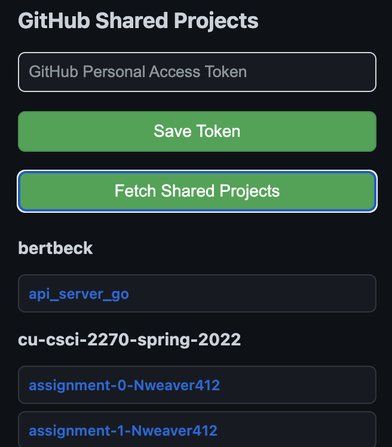

# GitHub Shared Projects Chrome Extension

This Chrome Extension allows you to easily access the GitHub repositories that you have collaborator access to. It fetches and displays a list of repositories shared with you by other users, grouped by the owner's username.

## Features:
- **Save GitHub Personal Access Token**: Securely store your GitHub token for easy authentication.
- **Fetch Shared Projects**: Fetch and display repositories shared with you by other users, with the ability to filter by visibility and collaboration.
- **Group Repositories by Owner**: View repositories grouped under the owner's username.
- **Back Button**: Navigate back to the token input page if you wish to change the saved token.

## Installation:
1. Download or clone this repository.
2. Open Chrome and go to `chrome://extensions/`.
3. Enable **Developer Mode** by toggling the switch in the top right corner.
4. Click **Load unpacked** and select the folder containing this project.
5. The extension will appear in your browser toolbar.

## Usage:
1. **Save your GitHub Personal Access Token**: On first launch, enter your GitHub token and click **Save Token**.
2. **View Shared Projects**: Once the token is saved, the list of repositories shared with you will be automatically displayed. You can click on any repository to open it in GitHub.
3. **Back Button**: If you need to change your token, click **Back** to return to the token input page.

## Prerequisites:
- **GitHub Personal Access Token**: To use this extension, you will need to generate a GitHub Personal Access Token (classic) with the necessary permissions. For instructions on how to create one, visit [GitHub's Token Documentation](https://docs.github.com/en/github/authenticating-to-github/creating-a-personal-access-token).
- **Google Chrome**: This extension is designed for use with Google Chrome.

## License:
This project is licensed under the MIT License - see the [LICENSE](LICENSE) file for details.
